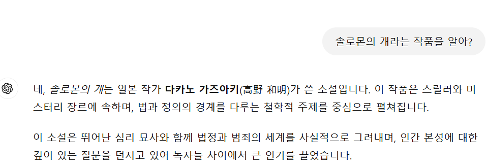

## 👑 팀명 : 퀸🫅 & 킹🤴 그리고 잼민이들🤦‍♂️<br>
<p align="center"></p>

 
### 🐿️ 팀원

|오정연|이호재|변가원|이진섭|김태욱|
|:---:|:---:|:---:|:---:|:---:|
|| | |  |  |
|[@Jungyunn](https://github.com/Jungyunn)|[@HoJL](https://github.com/HoJL)|[@dnjsrk](https://github.com/dnjsrk)|[@jururuj](https://github.com/jururuj)|[@Taeuk-Dog](https://github.com/Taeuk-Dog)|
|**Project Leader**<br/>LLM|LLM<br>Data Debugging|Data Preprocessing<br>ReadMe|Data Preprocessing<br>Streamlit<br>ReadMe|Streamlit<br> 화면구현<br>ReadMe 작성|


</div>

<hr>

### 🎖️ 프로젝트 개요
hallucination이 없는 챗봇 시스템 구현 

<hr>

### 🎖️ 프로젝트 목표


'Enco Library Chatbot'은 'Enco Library'가 소장한 도서에 대해 검색을 했을 때 hallucination이 없는 답변을 제공하는 것을 목표로 합니다.


<hr>

### 🔨 기술 스택
<div>

_Environment_
<br><br>


_Development_
<br><br>


<hr> 

### Data

국립중앙도서관의 Linked Open Data(LOD)에서 텍스트 기반의 일반 도서 정보 데이터셋을 이용하여 프로젝트를 진행하였습니다.
<br>
<br>

<br>
<br>
_data column_ 

```
title: 도서의 제목
creator: 도서의 저자
publisher: 도서의 출판사
issuedYear: 도서의 발행년도
issued: 도서의 출판년도
kdc: 도서의 한국 십진분류 코드
ddc: 도서의 듀이 십진분류 코드
alternative: 도서의 주제와 관련된 다른 도서
keyword: 도서의 키워드
seeAlso: 도서의 관련 링크
```

책 content의 경우 관련 정보가 부족하여 api를 활용하여 크롤링하였습니다.<br>
<hr>


### Preprocess

수집한 도서 데이터셋의 크기가 3700000개로 매우 방대하여 큰 파일을 70개로 나눈 후 그중 6개 파일을 선택하여 정제 후 하나로 합치고 그 파일을 24000개씩 나누어 9개의 정제된 파일을 만들었습니다.<br>

도서관에서는 책을 주제별로 숫자로 분류하여 서가에 정리합니다. 이때 사용되는 분류 체계가 KDC(한국십진분류)와 DDC(듀이 십진분류)입니다. <br>

정제 과정에서는 도서의 제목이 한글인 것으로 하도록 하였으며 KDC 코드와 DDC 코드의 앞 두 자리에 해당하는 주제를 찾아 각각 main_kdc_description과 main_ddc_description에 저장하였습니다. 또한, KDC와 DDC 코드가 모두 존재하는 경우, 국내 도서관에서 더 널리 사용되는 KDC를 기준으로 location(도서관 내 책의 위치)과 mainCategoryDescription(책의 주제)을 추출하도록 하였습니다.


<hr>

### System Architecture

 <br>

<hr>

### 수행 결과

<br>
기존의 gpt에서는 국립중앙도서관의 도서를 질문하였을 때 그 책에 대한 정보를 정확하게 답변해 주지 않는 hallucination 문제가 자주 발생하는 모습을 보였습니다. <br> Rag 기법을 이용하여 국립중앙도서관의 도서 정보에 관여하여 그 도서에 대한 정확한 답변을 추출할 수 있도록 하였습니다.

<hr>

### 한 줄 회고

오정연 - 데이터가 정말정말정말 중요하구나,,,
<br>
이호재 - 뀨우잉
<br>
변가원 - 모든 프로젝트는 기획 단계가 제일 중요하다,,,
<br>
이진섭 - 뀨잉
<br>
김태욱 - 뀨우